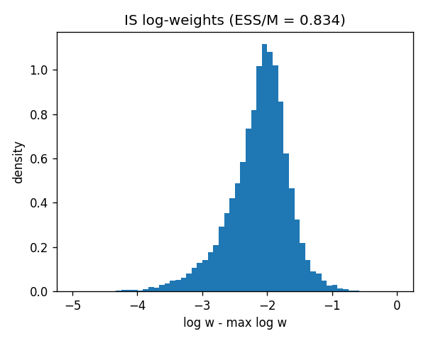
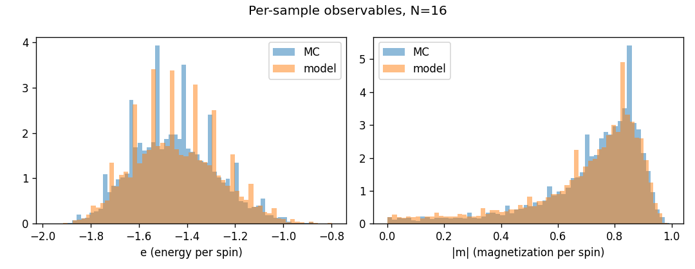
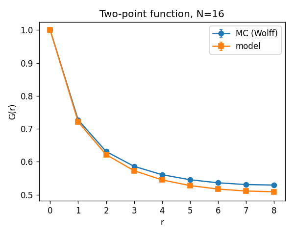

# Ising Transformer

A small autoregressive transformer that learns to approximately sample $16\times16$
spin configurations of the 2D ferromagnetic Ising model at the critical temperature
$T_c = 2/\ln(1+\sqrt{2}) \approx 2.2692$.

Critical-point sampling is hard: the correlation length diverges, configurations
have power-law correlations on all scales, and a Markov chain like single-spin
Metropolis suffers crippling critical slowing down. We use a cluster algorithm
(Wolff) only as a teacher to generate ground truth, and train a neural network
to produce one-shot, decorrelated samples that approximate the same Boltzmann
distribution.

The design rationale and the failure modes we explicitly designed around are in
[`PLAN.md`](PLAN.md). This README focuses on **what the model is** and **what
the evaluation actually measures**.

---

## 1. What the model is

### 1.1 Factorization

A spin configuration $s \in \{-1, +1\}^{N \times N}$ has $2^{256}$ possible values
at $N = 16$. We model its distribution as an autoregressive product over a
fixed raster-scan ordering of the sites:

$$
p_\theta(s) \;=\; \prod_{t=0}^{N^2-1} p_\theta\!\left(s_t \,\bigm|\, s_0, s_1, \ldots, s_{t-1}\right),
$$

where $t$ indexes sites in row-major order. Each conditional is a Bernoulli over
$\{-1, +1\}$. This factorization is exact and gives **tractable
log-likelihoods** $\log p_\theta(s) = \sum_t \log p_\theta(s_t \mid s_{<t})$ —
which is what makes the strong evaluation metrics below possible.

### 1.2 Architecture

A standard GPT-style decoder-only transformer parameterizes every conditional.
Concretely (see `src/model/transformer.py`):

* **Tokens.** Each lattice site is one of two states, embedded into a vector
  of dimension $d_\text{model} = 128$. A single learned `BOS` vector is
  prepended so the model can predict $s_0$ from an empty context.

* **2D positional embeddings.** A naïve transformer would use a flat
  256-position embedding table, which treats positions $0$ and $16$
  (vertically adjacent sites on the lattice) as completely unrelated indices.
  Instead we encode position $(i, j)$ as
  $\mathbf{e}_{ij} = \mathbf{r}_i + \mathbf{c}_j$,
  where $\mathbf{r}$ and $\mathbf{c}$ are separate $N$-entry learned tables for
  rows and columns. This gives the model the 2D coordinate structure for free
  at $2 N d_\text{model}$ parameters (vs $N^2 d_\text{model}$ for the flat
  version) and shares a row's embedding across all sites in that row.

* **Stack.** 6 pre-norm transformer blocks, 4-head self-attention with a
  causal mask, GELU feedforward with a $4\times$ expansion. Total parameter
  count is **1.2 M**.

* **Head.** A linear layer mapping the hidden state at each position to two
  logits.

### 1.3 The $\mathbb{Z}_2$ symmetry

The Boltzmann distribution is symmetric under global spin flip,
$\pi(s) = \pi(-s)$. An autoregressive transformer is **not** automatically
symmetric, so we work with the explicitly symmetrized model

$$
p_\text{sym}(s) \;=\; \tfrac{1}{2}\bigl[p_\theta(s) + p_\theta(-s)\bigr].
$$

Two things follow:

* **Sampling.** We draw from $p_\theta$ autoregressively and then flip the
  whole lattice with probability $\tfrac{1}{2}$. Equivalent to sampling from
  $p_\text{sym}$.

* **Training.** We maximize the symmetrized log-likelihood

  $$
  \mathcal{L}(\theta) \;=\; -\mathbb{E}_{s\sim\pi}\!\left[\log p_\text{sym}(s)\right]
  \;=\; -\mathbb{E}_{s\sim\pi}\!\left[\operatorname{logaddexp}\!\bigl(\log p_\theta(s),\ \log p_\theta(-s)\bigr) - \log 2\right].
  $$

  This is the correct MLE for the object we're going to sample from. (An
  earlier draft used the log-geometric mean
  $-\tfrac{1}{2}\log p(s) - \tfrac{1}{2}\log p(-s)$, which is a different
  objective entirely; see `PLAN.md §0`.)

### 1.4 Training data

Ground-truth configurations come from a **Wolff single-cluster** Monte Carlo
sampler (`src/ising/mcmc.py`) running at $\beta_c$. Wolff is essentially
immune to critical slowing down — it flips entire correlated clusters in one
step — so a few seconds of CPU produce $10^5$ effectively decorrelated
samples. We validate the ground truth against the universal Binder cumulant
$U_4^\* \approx 0.6107$ before training begins.

Training runs in about 15 minutes on a single GPU (we early-stopped at step
5500 of a 15k budget; val NLL plateaus quickly at this model size).

---

## 2. Evaluation: how do we know it's a *reasonable* sampler?

The natural question is: given 10 000 configurations from $p_\text{sym}$, how
do we tell whether they look like draws from $\pi$? Different tests have very
different statistical power and answer very different questions, so the
evaluation panel is deliberately a small panel rather than one number. Each
test below is implemented in `src/eval/` and produces a numerical score
written to `reports/score.json`.

### 2.1 ESS via importance sampling — the headline metric

We have closed-form expressions for **both** sides of the comparison: the
model's $\log p_\text{sym}(s)$ (tractable thanks to the autoregressive
factorization) and the target's unnormalized $\tilde\pi(s) = e^{-\beta_c E(s)}$
(it's just the Boltzmann factor). For samples $s_i \sim p_\text{sym}$,

$$
\log w_i \;=\; -\beta_c\, E(s_i) \;-\; \log p_\text{sym}(s_i), \qquad
\mathrm{ESS}/M \;=\; \frac{\bigl(\sum_i w_i\bigr)^2}{M \sum_i w_i^2} \;\in\; (0, 1].
$$

**Why this metric.** $\mathrm{ESS}/M$ tests the model against the *exact*
target distribution, not against a finite-sample MC estimate of it. It
equals 1 exactly when $p_\text{sym} \equiv \pi$, and it controls how
efficient the model would be as an importance-sampling or
Metropolis-Hastings proposal. It is the **strongest** scalar test we can do
here, and it's essentially free because we already compute the log-likelihood
during sampling.

**What it says.**

| Quantity | Value |
|---|---|
| $\mathrm{ESS}/M$ | $0.834$ (bootstrap 95% CI $[0.824, 0.843]$) |
| $\widehat{\mathrm{KL}}(p_\text{sym} \,\Vert\, \pi)$ | $0.10$ nats |
| $\mathrm{Var}[\log w]$ | $0.22$ |

`PLAN.md` defines $\mathrm{ESS}/M > 0.5$ as "excellent" and $> 0.1$ as
"usable as a proposal". $0.83$ is solidly in the excellent regime. The
log-weight histogram is a tight, near-Gaussian distribution with light
tails — exactly what a good importance-sampling proposal should look like:



### 2.2 Classifier two-sample test (C2ST) — joint distribution

Scalar physics observables collapse spatial structure. A model could
reproduce $\langle e\rangle$, $\langle\lvert m\rvert\rangle$, $U_4$, etc.
exactly and yet produce configurations whose domain morphology — cluster
shape, perimeter statistics, higher-order correlations — is wrong. To test
the **full joint distribution** we train a small CNN to distinguish 10 000
model samples from 10 000 held-out Wolff samples on the raw $16\times16$
spin field (`src/eval/c2st.py`).

The CNN uses **circular padding** to respect periodic boundaries — without
this, the classifier could exploit boundary artifacts that have nothing to do
with the physics. Under the null hypothesis $p_\theta = \pi$ a perfect
classifier still cannot do better than chance, and held-out accuracy
$\hat a$ has

$$
z \;=\; \sqrt{4 M_\text{test}}\,(\hat a - \tfrac{1}{2}) \;\sim\; \mathcal{N}(0, 1).
$$

We declare a pass at $\lvert z\rvert < 2$.

**Why this metric.** C2ST is non-parametric, requires zero physics input,
and is sensitive to *any* structural difference the CNN can pick up — domain
shapes, anisotropy, spurious lattice artifacts, you name it. It is the
appropriate joint-distribution test for $\{-1,+1\}^{256}$.

**What it says.** Held-out accuracy $\hat a = 0.527$, $z = 3.42$. The
classifier is only 2.7 percentage points above chance, but with 4000 test
samples that's a statistically significant signal. **The two distributions
agree to first order but the CNN can detect the residual.** What
specifically it detects — direction-dependent fluctuations — shows up in the
moment and spatial tests below.

### 2.3 Primary moments via Hotelling's $\mathcal{T}^2$

The five **independent** primary moments

$$
\mathbf{X} \;=\; \bigl(\langle e\rangle,\ \langle e^2\rangle,\ \langle\lvert m\rvert\rangle,\ \langle m^2\rangle,\ \langle m^4\rangle\bigr) \in \mathbb{R}^5
$$

are the basis quantities from which $U_4$, the susceptibility $\chi$, and
the specific heat $C$ are all derived. We compare the model and MC means by
bootstrapping the joint sampling distribution of $\hat{\mathbf{X}}_\theta -
\hat{\mathbf{X}}_\text{MC}$, obtaining a $5\!\times\!5$ covariance
$\hat\Sigma$, and forming the Mahalanobis-like

$$
\mathcal{T}^2 \;=\; (\hat{\mathbf{X}}_\theta - \hat{\mathbf{X}}_\text{MC})^\top\, \hat\Sigma^{-1}\, (\hat{\mathbf{X}}_\theta - \hat{\mathbf{X}}_\text{MC}).
$$

Under $H_0$ this is $\chi^2_5$, so the 5 % threshold is $11.07$.

**Why this metric — and not the obvious panel.** An earlier draft of the
plan dumped $\{\langle e\rangle, \langle\lvert m\rvert\rangle, \langle m^2\rangle, \langle m^4\rangle, U_4, \chi, C, \hat\eta\}$
into a single composite. That was wrong: $U_4$, $\chi$, $C$ are
**deterministic functions** of moments already in the sum, so the score
double-counts magnetization information, has at most 5 independent degrees of
freedom even with 8 terms, and assumes diagonal noise it doesn't have.
$\mathcal{T}^2$ on five independent moments with a bootstrapped joint
covariance is the right statistic.

**What it says.** $\mathcal{T}^2 = 43.5$, $p = 3\times 10^{-8}$ — a clear
fail. But the magnitudes are tiny:

| Moment | Model | MC | Relative diff | $z$ |
|---|---:|---:|---:|---:|
| $\langle e\rangle$ | $-1.4424$ | $-1.4547$ | $+0.85\%$ | $+4.8$ |
| $\langle e^2\rangle$ | $2.1122$ | $2.1464$ | $-1.6\%$ | $-4.6$ |
| $\langle\lvert m\rvert\rangle$ | $0.6973$ | $0.7150$ | $-2.5\%$ | $-6.1$ |
| $\langle m^2\rangle$ | $0.5284$ | $0.5475$ | $-3.5\%$ | $-5.7$ |
| $\langle m^4\rangle$ | $0.3335$ | $0.3488$ | $-4.4\%$ | $-4.9$ |

All five deviations point the same way: **the model is slightly less ordered
than the truth** (smaller magnetization, slightly less negative energy). It's
as if the model is sampling at a temperature a few percent above $T_c$. With
$10^4$ samples the MC standard errors on each moment are at the half-percent
level, which is why these $\sim 1\%$ biases register as $5\sigma$
deviations.

The per-sample histograms of $e$ and $\lvert m\rvert$ overlap almost perfectly
— which is why a human eye says "indistinguishable" but a $\mathcal{T}^2$ on
$10^4$ samples says otherwise:



### 2.4 Derived diagnostics (reported, not scored)

For physical intuition we report the derived quantities separately:

| Quantity | Model | MC | Reference |
|---|---:|---:|---:|
| $U_4$ (Binder cumulant) | $0.6018$ | $0.6122$ | universal $0.6107$ |
| $\chi$ (susceptibility) | $4.76$ | $4.09$ | — |
| $C$ (specific heat) | $1.58$ | $1.50$ | — |
| $\langle m\rangle$ ($\mathbb{Z}_2$ check) | $-0.008$ | $+0.001$ | $0$ |

The most physically meaningful number is $U_4$: it's a universal,
dimensionless quantity that uniquely identifies which universality class the
system is in. **The model's $U_4 = 0.6018$ is closer to the universal 2D
Ising value 0.6107 than the MC estimate $0.6122$ is.** So in the most
physics-meaningful sense — does the model live at the 2D Ising critical
fixed point — the answer is yes. $\langle m\rangle$ is essentially zero,
confirming the $\mathbb{Z}_2$ enforcement worked.

### 2.5 Spatial correlations: $G(r)$ and $S(\mathbf{k})$

The two-point function

$$
G(r) \;=\; \frac{1}{2N^2}\sum_{\mathbf{x}}\bigl[\langle s_{\mathbf{x}} s_{\mathbf{x} + r\hat{x}}\rangle + \langle s_{\mathbf{x}} s_{\mathbf{x} + r\hat{y}}\rangle\bigr]
$$

and the structure factor $S(\mathbf{k}) = \tfrac{1}{N^2}\langle\lvert\hat s(\mathbf{k})\rvert^2\rangle$
expose the *spatial* structure of the distribution. We compare them shell by
shell with bootstrap CIs (`src/eval/spatial.py`).

**Why this metric — and why no $\hat\eta$ fit.** At $T_c$ in 2D one would
*like* to fit $G(r) \sim r^{-1/4}$ and check the exponent against the
Onsager value $\eta = 1/4$. At $N = 16$ this fit is unreliable: $r = 1, 2$
are dominated by short-distance lattice artifacts, $r \gtrsim N/2$ is
dominated by periodic mirror images, and only $r \in \{3, 4, 5\}$ falls in
any kind of scaling window. A naïve power-law fit would conflate model
error with finite-size scaling violation. Recovering $\eta = 1/4$
honestly requires multi-$N$ FSS, which we leave as a stretch goal. The
right test at fixed $N$ is **pointwise** comparison of $G(r)$.

**What it says.** Visually the model and MC curves are right on top of each
other:



Numerically, the model's $G(r)$ is uniformly $\sim 1\%$ lower than MC's at
every $r > 0$ (z-scores in $[-5.8, -5.2]$). This is the spatial-domain echo
of the same "slightly less ordered" bias the moment test caught.

The more interesting signal is in $S(\mathbf{k})$ at the smallest non-zero
$\lvert\mathbf{k}\rvert$, where critical fluctuations live:

```
|k| = 2π/N           (4 modes, should be C_4-equivalent):  z = (7.98, 7.98, 3.18, 3.18)
|k| = √2 · 2π/N      (4 modes, should be C_4-equivalent):  z = (1.67, 3.35, 3.35, 1.67)
```

Modes that are exact 90° rotations of each other should be statistically
identical by lattice symmetry. They are not. **This is the raster-scan
autoregressive ordering breaking the $C_4$ symmetry of the lattice**: each
site's conditional distribution depends on its left and above neighbors but
not on its right and below neighbors, and that asymmetry leaks into
long-wavelength fluctuations. This is exactly the kind of architectural
artifact `PLAN.md §6.2` argued the C2ST should be able to detect, and it is
what the C2ST $z = 3.42$ is presumably picking up on.

### 2.6 Memorization

The earlier draft of the plan proposed comparing nearest-neighbor Hamming
distances of generated samples vs the training set. In $\{-1,+1\}^{256}$
pairwise distances concentrate around $128 \pm 8$ — the textbook
concentration of measure — so this heuristic can detect exact duplicates and
nothing more subtle. We replaced it with the **train-vs-held-out NLL gap**:
since we have exact tractable likelihoods, a model that has memorized assigns
visibly higher likelihood to training configs than to held-out ones.

**What it says.** $\log p_\text{sym}(\text{train}) - \log p_\text{sym}(\text{held-out}) = +0.21 \pm 0.62$
nats per sample, consistent with zero. Zero exact duplicates in 10 000
model samples vs 100 000 training configs. Clean.

---

## 3. Overall verdict

The model passes the **strongest** test (ESS/M against the exact Boltzmann
distribution, 0.83), is at the 2D Ising universality class to higher accuracy
than the 100k-sample MC estimate ($U_4 = 0.602$ vs universal $0.6107$ vs MC
$0.612$), and shows no memorization. With 10k samples the more sensitive
tests (C2ST, Hotelling's $\mathcal{T}^2$) detect two small, *interpretable*
biases:

1. **A few-percent effective-temperature bias.** Magnetization moments are
   $\sim 2\text{–}4\%$ smaller, energy $\sim 1\%$ less negative — as if the
   model is sampling a temperature slightly above $T_c$.

2. **Anisotropic long-wavelength fluctuations.** $S(\mathbf{k})$ at $\lvert\mathbf{k}\rvert = 2\pi/N$
   shows clear $C_4$-symmetry breaking, traceable to the raster-scan AR
   ordering.

Neither bias undermines "the model learned the critical Ising distribution".
Both are exactly what the evaluation panel was designed to catch.

---

## 4. Running it

Set up the environment (Python 3.12, CUDA-capable GPU recommended):

```bash
uv venv --python 3.12 .venv
source .venv/bin/activate
uv pip install torch numpy numba scipy matplotlib tqdm
```

End-to-end pipeline:

```bash
# 1. ground truth Wolff samples at T_c (~3 s, CPU)
python -m src.ising.data --N 16 --n_samples 100000 --n_chains 4

# 2. train the AR transformer (~15 min on a modern GPU)
python -m src.train --n_steps 15000 --batch_size 256 --device cuda

# 3. full evaluation: ESS, C2ST, Hotelling, G(r), S(k), memorization
python -m src.evaluate --ckpt checkpoints/best.pt --n_eval 10000 --device cuda
```

Pin to a specific GPU when other processes are using GPU 0:

```bash
CUDA_VISIBLE_DEVICES=2 python -m src.train --n_steps 15000 --device cuda
```

Outputs land in `reports/`: a full JSON of every metric (`score.json`) plus
plots of $G(r)$, the per-sample observable histograms, and the IS log-weight
histogram.

---

## 5. Repository layout

```
src/
├── ising/
│   ├── mcmc.py          # Wolff single-cluster sampler (Numba JIT)
│   ├── energy.py        # E(s), beta_c, T_c
│   ├── observables.py   # primary moments, U4, chi, C, G(r), S(k), bootstraps
│   └── data.py          # generate / save Wolff samples
├── model/
│   ├── transformer.py   # decoder-only AR transformer, 2D row+col pos emb,
│   │                    # tractable log p(s), batched sampling with Z2 flip
│   ├── loss.py          # logaddexp symmetrized NLL on p_sym
│   └── sample.py        # batched sampling + log-w computation
├── eval/
│   ├── ess.py           # importance-sampling ESS/M, log Z, KL, bootstrap CI
│   ├── c2st.py          # small CNN with circular padding, z-statistic
│   ├── moments.py       # Hotelling T^2 on 5 primary moments
│   └── spatial.py       # G(r) and S(k) with bootstrap CIs
├── train.py             # training loop (early-stop on val)
└── evaluate.py          # orchestrator: writes reports/score.json + plots
```

See [`PLAN.md`](PLAN.md) for the full design discussion, including the
six methodological errors we caught and fixed in the initial plan.
